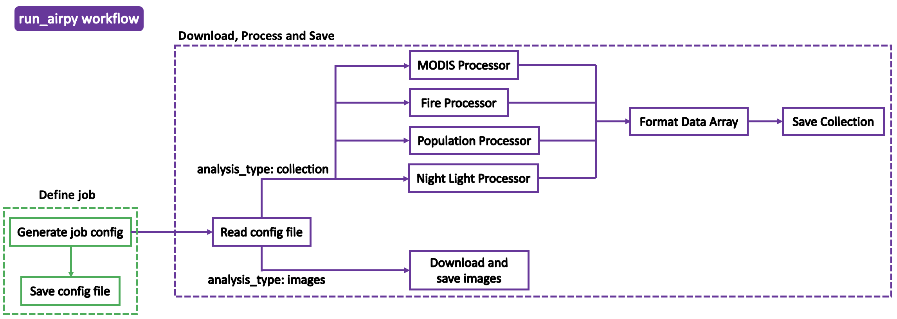

# Summary

Air pollution is the world’s largest environmental risk factor for human disease and premature death, resulting in more than 6 million premature deaths in 2019, several times more than from AIDS, tuberculosis, and malaria combined [@Fuller:2022; @Worldbank:Pollution; @SOGA2020]. Currently, there is still a challenge to model the pollutant surface ozone (O3), particularly at scales relevant for human health impacts, with the drivers of global ozone trends at these scales largely unknown. A better understanding of factors of surface ozone at urban scales can improve environmental policy making to reduce risks from pulmonary disease, heart disease, lung cancer, stroke, and asthma [@Cohen:2017; @WHO:2018]. `airPy` is a Python package to extract high resolution surface information from Google Earth Engine and compute relevant metrics for air quality studies for any location on the Earth’s surface, for use in Machine Learning models and other statistical analysis. The package provides functionality to compute metrics from MODIS land cover, World Population, MODIS Burnt pixel, and VIIRS Nighttime lights data, and is designed to be generalizable to support additional datasets. The primary purpose of `airPy` is to automatically extract remote sensing information from Google Earth Engine, and perform relevant statistics that can be used for further studies of the impact of Earth surface characteristics on air pollution globally.

# Statement of need

While significant progress has been made in reproducing regional and global ozone fields and their attributions using chemical transport models and data assimilation techniques, including NASA Jet Propulsion Laboratory’s Multi-mOdel Multi-cOnstituent Chemical data assimilation (MOMO-Chem) framework [@Miyazaki:2020], there is still a challenge to reproduce surface ozone, especially at urban scales relevant for human health impact assessments. Ozone formulation is a highly complex phenomena, formed through atmospheric and chemical reactions, and can be transported on spatial scales of hundreds of thousands of kilometers [@Betancourt2021]. Dominant precursor substances like nitrogen oxides, carbon monoxide and Volatile Organic Compounds (VOCs), are emitted from human activities like traffic, industry and agriculture [@Benkovitz1996; @Field1992], which motivates this study to integrate land surface information into the existing MOMO-Chem framework to investigate these drivers of air quality on a global scale. The NASA JPL Scientific Understanding from Data Science (SUDS) strategic initiative is designed to form interconnected teams between the data science and physical science communities to leverage data science techniques for improving scientific research through revealing new connections in data. `airPy` was developed with the purpose of seamlessly integrating Earth surface information into the Machine Learning framework used for the SUDS Air Quality project, with the objective to improve our understanding and prediction of global air quality with machine learning.

`airPy` provides an extensible framework within Python to extract and process relevant high-resolution remote sensing data from Google Earth Engine and generate machine learning ready metrics for global air quality analysis. To interact with the GEE API, the user must sign up and obtain an API key linked to their Google account. A `airPy` pipeline job is fully defined by the configuration file specified by the user via the `generate-config` module. The pipeline is run via: ` python run_airpy.py`  The command accepts arguments `--gee_data` specifying the GEE dataset to download, `--region` specifying the boundary region on Earth, `--date` specifying the date of data extraction, `--analysis_type` specifying if the user would like to analyze over an entire collection of features or extract raw images, `--add_time` specifying if a time component will be added to the analyzed collection xarray dataset (useful for integrating into existing time series machine learning datasets), `--buffer-size` denoting the region of interest buffer extent per point, `--configs_dir` specifying the configuration file directory and `--save_dir` specifying the directory to save the run.

The `run_airpy` command runs the `airPy` pipeline with the user-specified configuration information, and `airPy` then downloads and processes the user-specified GEE dataset, generating either an xarray formatted dataset of features from the GEE collection if `--analysis_type` is collection, or saving individual images if `--analysis_type` is images. `airPy` supports the MODIS Yearly Land Cover 500m [@MODIS2021], MODIS Fire Burned Pixel Product [@Padilla2018], VIIRS Nighttime Day/Night Band Composites [@Elvidge2017], and Gridded Population of the World Version 4.11 [@CIESIN2018] GEE collections. The metrics calculated for MODIS Land Cover are mode, variance, and percent coverage of each of the 17 land classes per defined region. The metrics calculated for MODI Fire Burned Pixel Product are mode, variance, percent coverage each of the 17 land classes and total percent burnt and unburnt per defined region for the analysis year specified. Maximum, minimum, average, and variance metrics for the day night band (DNB) radiance and population density are computed for the VIIRS Nightimte Day/Night Band Composites and Gridded Population of the World data respectively. The `airPy` pipeline uses multiprocessing to reduce computation runtime down from 6-7 hours without multiprocessing to 45 minutes for an entire collection covering the globe. Figure 1 outlines the package structure and Figure 2 depicts an example of the GEE extraction process over a latitiude, longitude point in Australia.

# Figures
|
|:--:| 
| *Figure 1. `airPy` flow diagram* |

|
|:--:| 
| *Figure 2. Example of `airPy` GEE extraction. For a given latitude, longitude point and specified buffer, draw a circular buffer zone to extract land surface data from to then process features of interest (i.e. maximum population per grid point from World Population dataset, percent of each land cover class from MODIS dataset, etc.)* |

# Acknowledgements

The `airPy` package was developed to support the NASA Jet Propulsion Laboratory’s Scientific Understanding from Data Science Air Quality initiative. K. Doerksen was funded through the Oxford-Singapore Human-Machine Collaboration Programme, supported by a gift from Amazon Web Services, studentship from Satellite Applications Catapult and Deimos Space, and the EPSRC Centre for Doctoral Training in Autonomous Intelligent Machines and Systems through grant number EP/S0245050/1.

# References
